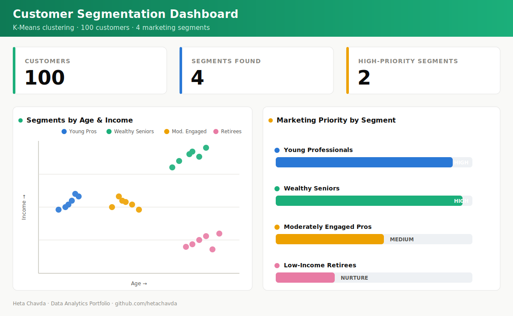

<div align="center">



# 🎯 Marketing Segmentation Analysis
### Turning 100 Customers into 4 Actionable Segments with K-Means Clustering


</div>

---

## 📌 Project at a Glance

| | |
|---|---|
| **🎯 Goal** | Group customers so marketing spend targets the *right* people |
| **🧠 Method** | K-Means Clustering (4 segments) |
| **📊 Data** | 100 customers — age, income, gender, region, behavior |
| **💡 Outcome** | 4 clear personas, each with its own marketing strategy |

---

## 🧩 Business Problem

Marketing budgets are limited — spending the same way on every customer wastes money.

> **Which customers should we invest in, and what message works for each group?**

By segmenting customers into distinct groups, the business can **spend where the return is highest** and speak to each group in the way that actually converts.

---

## 🗂️ Dataset

| Attribute | Detail |
|---|---|
| **Size** | 100 customers |
| **Features** | Age, Income, Gender, Region, purchasing patterns, promotion engagement |
| **Prep** | Cleaned in Excel, analyzed & visualized in Python |

---

## 🔬 Methodology

```
1. Data Cleaning    →  Fix missing values, standardize fields (Excel)
2. Feature Scaling  →  Normalize age & income for fair distance
3. K-Means          →  Cluster into 4 optimal segments
4. Profiling        →  Describe each segment's traits
5. Strategy         →  Map a tailored marketing plan per segment
```

**Why K-Means?** It's fast, interpretable, and naturally groups customers by similarity — perfect for building marketing personas.

---

## 📊 Segmentation Dashboard

<div align="center">



*Four customer segments by age and income, each mapped to a marketing priority.*

</div>

---

## 📈 Key Insights — The 4 Segments

| Segment | Profile | Marketing Strategy | Priority |
|---|---|---|---|
| 🔵 **Young Professionals** | Younger, mid-income, digital-first | Affordable quality, personalized online promos | 🔴 High |
| 🟢 **Wealthy Seniors** | Older, high-income | Premium products, loyalty rewards, hybrid retail | 🔴 High |
| 🟡 **Moderately Engaged Pros** | Mid age & income | Mid-range practical items, value offers | 🟠 Medium |
| 🔴 **Low-Income Retirees** | Older, budget-conscious | Basic goods, local & community campaigns | 🟡 Nurture |

---

## 💼 Business Impact

| Benefit | How the Analysis Delivers |
|---|---|
| **💰 Higher ROI** | Focus budget on high-value segments (Young Pros & Wealthy Seniors) |
| **🎯 Right Message** | Each segment gets messaging that fits its behavior |
| **🤝 Better Retention** | Community partnerships keep retirees engaged at low cost |
| **⚙️ Scalable** | Framework supports real-time updates & AI personalization |

---

## 🛠️ Technologies Used

| Category | Tools |
|---|---|
| **Language** | Python |
| **ML** | scikit-learn (K-Means) |
| **Data** | Pandas, NumPy, Excel |
| **Visualization** | Matplotlib, Seaborn |

---

## 📁 Repository Contents

```
Marketing-Segmentation-Analysis/
├── 📁 assets/
│   ├── 🎨 banner.svg                                                     # Repository banner
│   └── 📊 dashboard.svg                                                  # Segmentation dashboard
├── 📁 code/
│   ├── 📄 Group12_PythonCodesSegmentation.py                             # Clustering code
│   └── 📄 app.py                                                         # Application script
├── 📁 data/
│   └── 📊 Group12Presentation_market_segmentation_data_Charts_Analysis.xlsx  # Data, charts & analysis
├── 📁 docs/
│   └── 📄 Marketing Analytics Segmentation.pdf                           # Findings & strategy
└── 📝 README.md                                                          # Project overview
```

---

<div align="center">

**Heta Chavda** — Data Analytics | Machine Learning | Business Intelligence

[](https://github.com/hetachavda)

⭐ *Found this useful? Give it a star!*

</div>
